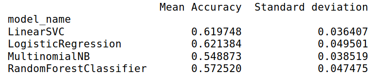
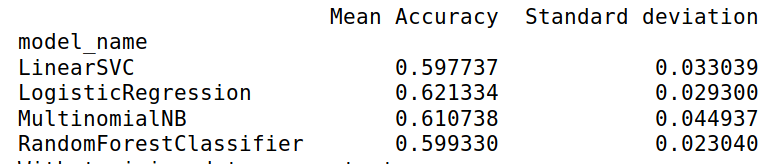
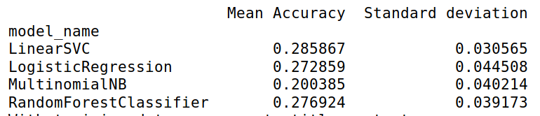
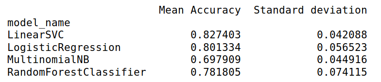

# flair-detector
### Overview
Flair detector is a web app that can detect the flair (category) of a Reddit post of the subreddit r/india.
link to the heroku app:- https://reddit-flair-detector-precog23.herokuapp.com/
### Directory structure
***templates :-*** Contains the necessary HTML pages to view the webpage. 
***Procfile :-*** Contains the command that is executed on the startup of heroku app. 
***data.json :-*** Contains the imported mongodb collection into json format. 
***fitted_factorizer :-*** Contains the saved vector that is used to transform the given input, to be able fit in the ML model. 
***model_joblib :-*** Contains the ML model. 
***requirements.txt :*** Contains the dependencies needed for heroku to build the web app. 
***script.py :-*** Contains the backend written with flask. 
***script2.ipynb :-*** This is the jupyter notebook in which the ML model was created and tested and the data was saved to the mongodb collection. 
### Dependencies
praw==6.3.1 
Flask==1.1.1 
itsdangerous==1.1.0  
Jinja2==2.10.1      
gunicorn==19.9.0 
MarkupSafe==1.1.1 
Werkzeug==0.15.5 
sklearn==0.0   
pymongo==3.8.0 
dnspython==1.16.0  
To run the run the program locally, type the command "python3 script.py" in the terminal.
### Approach used 
Data is extracted using praw. 110 posts from each flair are extracted and saved in a dictionary which is then converted into a dataframe. Then the data is saved in the mongodb collection on the cloud.After that each flair is mapped to number('category_id') so that it is easier to implemnt the model. The raw input data is converted into matrix of TF-IDF features using sklearn's TfidfVectorizer with parameters:- stop_words='english'(To remove the words like-'and','the' etc.),ngram_range=(1,2)(to consider unigrams and bigrams) ,min_df=5(to ignore terms that have a document frequency strictly lower than the given threshold),sublinear='true'(To Apply sublinear tf scaling, i.e. replace tf with 1 + log(tf). Therefore the benefit of using these parameters is that important keyword are given more weightage.After this input data is divided into training and testing using sklearn's train_test_split (i.e =75% data for training, 25% data for testing).Then the following algorithms are tested on the data:-RandomForestClassifier,LinearSVC,MultinomialNB,LogisticRegression. And following are the observations:- 
With training data as comments:- 

With training data as title:- 
  
With training data as content:- 

With training data as comments+title+content:-  

 
As it can be observed that Linear Support Vector Classification has the maximum accuracy with comments+title+content as data. So this model is chosen and saved using sklearn's joblip. Script.py loads this model and outputs the prediction with the help of flask as the backend.
### Refrences
1.The template for bar graph was taken from here:-https://canvasjs.com/html5-javascript-bar-chart/  
2. https://kavita-ganesan.com/tfidftransformer-tfidfvectorizer-usage-differences/#.XTYCDfzhWV5 
3. https://praw.readthedocs.io/en/latest/  
4.Usage sklearn's models were learn from here:- https://www.kaggle.com/selener/multi-class-text-classification-tfidf
